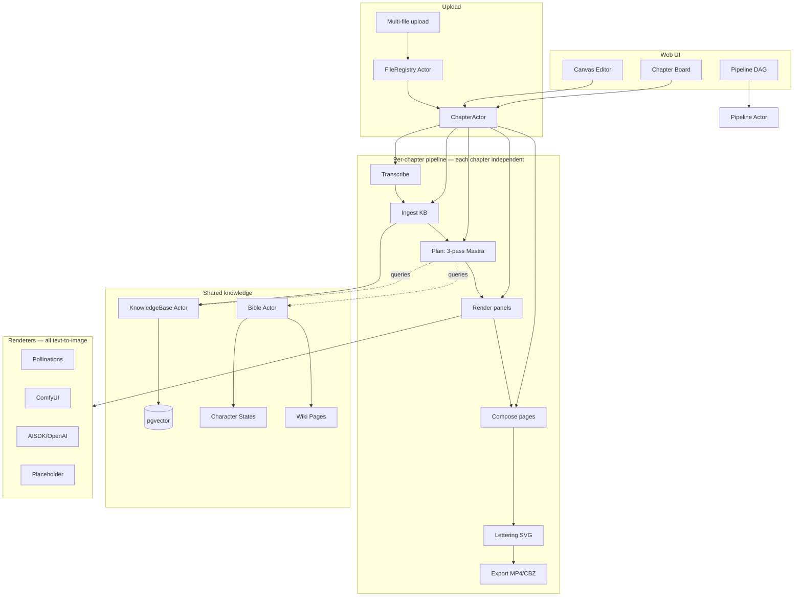

# AudioComic Full Audit — 2026-06-29

> Branch: `review/full-audit`
> Reference: MangaFlow paper (arXiv:2502.18043), GOAL spec (attachment-1.md)
> Method: 5 parallel explore agents audited domain/db, ai/prompt, pipeline/actors, renderers/media, web/ui. Manual investigation of workflows, knowledge, evals, shared, docs. Typecheck run for ground truth.

---

## Executive Summary

AudioComic is a **hybrid agentic + deterministic media pipeline** that converts audiobooks into narrated comic books. It follows the MangaFlow paper's structured approach: story planning → section memory → layout → reference-conditioned rendering → composition → lettering → motion export.

**What works well:**
- The core architecture is sound: 6 Rivet actors with Effect-based orchestration, per-chapter independent pipelines, a 3-pass Mastra story planner with KB tool integration
- The canvas-based comic editor (ReactFlow + dnd-kit + bubble overlay) is genuinely production-quality
- Deterministic layout validation (bounds, overlap, coverage, reading order) is real and persisted
- Motion comic export with FFmpeg zoompan is timeline-synchronized and supports 6 motion types
- 49 API routes, full CRUD for panels/pages/lettering, per-chapter export (MP4 + CBZ)
- pgvector with HNSW indexes on 7 tables — the retrieval infrastructure is real

**What's broken or missing:**
- **314 typecheck errors** across 98 files — the monorepo does not typecheck cleanly
- **Section memory is a no-op stub** — the MangaFlow M_k formula is not built or used
- **No reference conditioning** — all 4 renderers are text-to-image only; `referenceImageKeys` is always `[]`
- **Panel QA is a placeholder** — marks every panel "passed" with zero checks
- **No word-level timestamps** — transcription returns `words: []` always
- **No diarization** — interface exists, no implementation
- **8 orphaned step files** — dead code from a pipeline consolidation that was never cleaned up
- **No tests** anywhere in the monorepo
- **Drizzle ↔ migration drift** — `transcript_chunks.speaker` and `render_model` columns missing
- **No Issue entity** — planned in ARCHITECTURE_PLAN.md, never implemented
- **No storyboard review UI** — users can't inspect the story plan before rendering
- **No PDF export** — stubbed to CBZ
- **No audio chapter detection** — ffprobe doesn't use `-show_chapters`

---

## 1. MangaFlow Alignment Audit

The MangaFlow paper (Algorithm 1) defines a 6-stage pipeline. Here's how AudioComic maps to it:

### 1.1 Story Planning (Paper §3.4) — ✅ Strong

| Paper Component | Implementation | Status |
|---|---|---|
| Story prompt → pages, panels, sections | 3-pass Mastra agent (scenes → beats → panels) | ✅ Working |
| Section decomposition `s_k = (d_k, e_k, C_k, O_k)` | `StorySection` with level, summary, charactersPresent, objects | ✅ Working |
| Hierarchical sections (chapter → scene → beat) | `parentId` chain with `level` enum | ✅ Working |
| KB tool integration for cross-chapter context | 4 Mastra tools (vector-query, character-lookup, world-lookup, timeline) | ✅ Working |
| Structured output (Zod) | `pass1Schema`, `pass2Schema`, `pass3Schema` | ✅ Working |
| Character descriptions (visual, specific) | Agent prompt instructs "be SPECIFIC and VISUAL" with examples | ✅ Good |

**Gap:** Two parallel planner implementations exist (`packages/ai/src/planner.ts` AI SDK version vs `packages/actors/src/agents/index.ts` Mastra version). The Mastra version is the production path; the AI SDK version is dead code. No tests ensure equivalence.

### 1.2 Section Memory (Paper §3.4) — ❌ Stub

| Paper Component | Implementation | Status |
|---|---|---|
| `M_k = (d_k, R_scene, R_char, R_obj, φ_k)` | `buildSectionMemory()` in `prompt.ts:26` | ⚠️ Exists but **never called** |
| Section memory step in pipeline | `section_memory.ts` | ❌ **No-op stub** — counts sections, writes nothing |
| Embeddings for section retrieval | pgvector columns exist on 7 tables | ⚠️ Infrastructure exists, `section_memory` step doesn't use it |
| Panel prompt includes `M_z(i,j)` | `composePanelPrompt` accepts 5th param | ❌ **Param accepted but ignored** — comment says "causes multi-panel generation" |

**The core MangaFlow innovation — section memory binding sections to visual references for cross-panel consistency — is not operational.** The function exists, is exported, call sites pass the data, but `composePanelPrompt` discards it. The `section_memory` pipeline step is a no-op.

### 1.3 Layout Control (Paper §3.5) — ✅ Strong

| Paper Component | Implementation | Status |
|---|---|---|
| Layout as first-class variable | `PageSpec` with `panelCount`, `readingOrder`, `bleedGutter` | ✅ |
| Layout agent generation | `plan_pages` / `plan_chapters` produces grid layouts | ✅ |
| Deterministic projection `Π(L)` | `validatePageLayout()` in domain — 5 checks | ✅ |
| Panel count, overlap, bounds, coverage, reading order | All 5 checks implemented and persisted | ✅ |
| Layout self-reflection (paper ablation) | Not implemented | ⚠️ Low priority (paper shows 0.86% → 0.62% overlap improvement) |

### 1.4 Reference-Conditioned Rendering (Paper §3.6) — ❌ Not Implemented

| Paper Component | Implementation | Status |
|---|---|---|
| `R_i,j = ComposeRef(R_scene, R_char, R_obj)` | `PanelRenderRequest.referenceImageKeys` | ❌ Always `[]` |
| Character reference images | `CharacterProfile.canonicalFaceRef`, `canonicalBodyRef`, `outfitRefs` | ⚠️ Schema exists, DB columns exist, **never populated or used** |
| IP-Adapter / ControlNet | ComfyUI `RenderPreset` has `ipAdapterRefs`, `controlNetControls` | ❌ Schema fields exist, `buildWorkflow()` ignores them |
| Renderer receives references | `render_panels.ts:75` passes `referenceImageKeys: []` | ❌ Hardcoded empty |

**This is the biggest gap vs the paper.** The entire reference-conditioning pipeline is scaffolded in schemas but not wired. No renderer consumes reference images. The ComfyUI adapter builds a minimal KSampler graph with no IP-Adapter or ControlNet nodes.

### 1.5 Page Composition (Paper §3.7) — ✅ Working

| Paper Component | Implementation | Status |
|---|---|---|
| `ComposePage({I_ij}, L̃_i)` | `composite.ts` using sharp | ✅ Deterministic |
| Panel placement by bbox | `fit: 'cover'` resize to bbox pixels | ✅ |
| Gutters | `bleedGutter.gutter` → pixel subtraction | ✅ |
| Bleed | `bleedGutter.bleed` defined in schema | ⚠️ **Never read** by compositor |

### 1.6 Lettering (Paper §3.7) — ✅ Working, ⚠️ No Face Occlusion Avoidance

| Paper Component | Implementation | Status |
|---|---|---|
| Text placement as separate pass | SVG overlay (`lettering.ts`) | ✅ |
| Speech bubbles, narration, thought, SFX | All 4 types implemented | ✅ |
| Bubble tail targeting | `tailTarget` normalized coordinate | ✅ |
| Face occlusion avoidance | Not implemented | ❌ Paper's Bubble Placement Score metric |
| User-editable bubble positions | `BubbleOverlay.tsx` with drag/edit/delete | ✅ UI works |

---

## 2. Pipeline & Actor System

### 2.1 Actor Inventory (6 actors)

| Actor | State | Actions | Status |
|---|---|---|---|
| FileRegistry | files map | Upload, RegisterPath, GetFile, ListFiles, Delete | ✅ Complete |
| Bible | lore, characters, chapters, states, wiki | 10 actions including MergeChapterKnowledge with conflict resolution | ✅ Complete |
| Project | config, chapters, pipelines | 10 actions | ✅ Complete |
| Pipeline | status, steps, schedule | 15 actions: Start/Pause/Resume/Retry/Skip/RunStep/Invalidate/Schedule | ✅ Complete |
| Chapter | stage, status, transcription | 14 actions with 5 background fibers (transcribe → ingest → plan → render → compose) | ✅ Complete (1048 lines) |
| KnowledgeBase | per-chapter embedding/wiki status | IngestChapter, Query, GetWiki, Lint, GetCharacterTimeline | ✅ Complete |
| **Issue** | — | — | ❌ **Does not exist** |

### 2.2 Step Executors — 9 registered, 8 orphaned

**Registered (active pipeline):**
1. `ingest_knowledge` ✅ — real embeddings + wiki ingest per chapter
2. `build_bibles` ✅ — agent-based bible builder per chapter
3. `plan_chapters` ✅ — mega-step (segment + plan_story + plan_pages + compose_prompts), 321 lines
4. `render_panels` ✅ — real rendering, skips already-rendered via DB
5. `panel_qa` ⚠️ — **PLACEHOLDER: marks all panels "passed"**
6. `compose_pages` ✅ — real sharp composition
7. `lettering` ✅ — real SVG overlay
8. `export_static` ✅ — real ZIP/CBZ
9. `export_motion` ✅ — real FFmpeg MP4 with Ken Burns

**Orphaned (dead code — files exist, not imported in `index.ts`):**
- `normalize.ts`, `transcribe.ts`, `segment.ts`, `plan_story.ts`, `section_memory.ts`, `plan_pages.ts`, `compose_prompts.ts`, `validate_layout.ts`

These were absorbed into `plan_chapters` and ChapterActor fibers but never deleted. They should either be removed or re-registered as standalone DAG steps for granular control.

### 2.3 Key Pipeline Issues

1. **`getPrevResult` throws raw JS Errors** outside Effect channels (`helpers.ts:16-18`). Steps that don't wrap with `Effect.sync` will crash the execution fiber.
2. **`Effect.orDie` overused** — every `State.get`/`State.updateAndGet` uses it, making schema mismatches unrecoverable defects instead of recoverable errors.
3. **No per-panel regeneration action** — must re-run entire `render_panels` step (idempotent via `renderResultId` check, but not granular).
4. **No pipeline-level timeout** — individual steps have optional `timeoutMs`, but the overall `runLoop` can block indefinitely.
5. **Dead `PipelineAdapter` service** — `services.ts` has a NOP adapter that only logs; all real adapter calls go through `PipelineBridge` directly.

---

## 3. AI Layer

### 3.1 Story Planner — Two Parallel Implementations

| Feature | AI SDK (`planner.ts`) | Mastra (`agents/index.ts`) |
|---|---|---|
| Passes | 3 (world→beats→panels) | 3 (scenes→beats→panels) |
| KB tools | ❌ No | ✅ vector-query, character-lookup, world-lookup, timeline |
| Structured output | Zod via `streamObject` | Zod via `tryGenerateWithJsonFallback` |
| Providers | 5 (openai, anthropic, google, groq, pollinations) | 3 (openrouter, pollinations, openai) |
| Used in production | ✅ Yes (wiki ingestor) | ✅ Yes (ChapterActor + plan_chapters) |

**Clarification:** The AI SDK planner is NOT dead code — it's the LLM backend for `makeWikiIngestor` (called from `chapter/live.ts`, `knowledge-base/live.ts`, `ingest_knowledge.ts`). The Mastra agent is used for story planning. They serve different purposes. The risk is having two planner implementations with no test parity, not dead code.

### 3.2 Prompt Engineering — Good but Disconnected

`composePanelPrompt` has a well-documented 9-part structure with deliberate token ordering (characters first, then environment, then technical). The camera framing map and emotional tone → visual cue map are thoughtful.

**But:** `buildSectionMemory` is a dead code path. The function exists, is exported, call sites pass the data, but `composePanelPrompt` ignores the 5th parameter entirely. Comment at `prompt.ts:186-189`:
```
// NOTE: Continuity context (section memory) is intentionally omitted from
// the image prompt. It causes the model to generate multi-panel pages
```

This is a **design decision, not a bug** — but it means the MangaFlow section memory concept is not operationalized for image generation. The continuity is handled by the planner agents (KB tools), not by the image renderer.

### 3.3 Transcription

| Feature | Status | Detail |
|---|---|---|
| Providers | ✅ OpenAI Whisper + Groq Whisper | Groq uses curl workaround (AI SDK hardcodes filename) |
| Word-level timestamps | ❌ | `words: []` always returned. Comment: "unreliable across provider versions" |
| Diarization | ❌ | Interface exists, no implementation. `deps.ts` returns `[]` |
| Chunking | ✅ | ~40-word groups at sentence boundaries |
| Error handling | ✅ | Retries, backoff, silence removal (Groq) |

**Impact:** Without word-level timestamps, the narration timeline for motion comic export relies on segment-level timing only. Panel-to-audio synchronization is coarse.

### 3.4 TTS — ✅ Implemented (OpenAI only)

`tts-1` with speed/format/instructions support. OpenAI-only provider lock.

### 3.5 Image Generation — OpenAI only, no reference conditioning

| Adapter | Provider | Reference Conditioning | Notes |
|---|---|---|---|
| AISDK | OpenAI (gpt-image-1, dall-e-3) | ❌ | Text-to-image only |
| ComfyUI | Self-hosted SD | ❌ (schema exists, not wired) | `buildWorkflow()` ignores `ipAdapterRefs`, `controlNetControls`, `loraSet` |
| Pollinations | FLUX / z-image-turbo | ❌ | Simple GET API |
| Placeholder | Local sharp | N/A | Deterministic SVG → PNG |

---

## 4. Domain & DB Layer

### 4.1 Entity Completeness

All 16 GOAL spec entities exist as Zod schemas and DB tables. Additional entities: Chapter, CharacterState, KnowledgePage, KnowledgeEmbedding, ChapterIngestLog, WorldBible, JobRecord.

**Missing entities:**
- `Issue` — planned in ARCHITECTURE_PLAN.md, no schema, no table
- `panel_edits` — planned, no schema, no table
- `lettering_edits` — planned, no schema, no table

### 4.2 Schema/DB Drift — HIGH RISK

| Issue | Severity | Detail |
|---|---|---|
| `transcript_chunks.speaker` | HIGH | Column exists in migration SQL, **missing from Drizzle schema** → repo `fromRow` drops it |
| `projects.render_model` | HIGH | Column in Drizzle schema, **no migration** → runtime error |
| `panel_render_requests.model/provider` | MEDIUM | Domain schema has fields, DB schema doesn't → data loss |

### 4.3 pgvector — ✅ Real

HNSW indexes on 7 tables (story_sections, character_profiles, scene_profiles, object_profiles, world_bibles, transcript_chunks, knowledge_embeddings). All `vector(1536)`. `setEmbedding` repo method supports 5 tables. The knowledge package (`embeddings.ts`, `rag.ts`, `wiki-ingestor.ts`) generates and queries embeddings.

### 4.4 Repository Gaps

- `getSettings`/`saveSettings` are **no-op stubs** (`repo.ts:587-593`)
- No batch operations (getByChapterId, bulk insert)
- No FK constraint on `source_assets.chapter_id`

---

## 5. Renderer & Media Layer

### 5.1 Renderers — All Text-to-Image

No renderer consumes `referenceImageKeys`. The ComfyUI adapter has the most potential — its `buildWorkflow()` could add IP-Adapter and ControlNet nodes, but currently builds a minimal 6-node graph. The `RenderPreset` schema carries `ipAdapterRefs`, `controlNetControls`, `loraSet` but all default to `[]` and are never populated.

### 5.2 Page Compositor — ✅ Deterministic

Sharp-based, bbox-driven, with gutter support. **Bleed is defined in schema but never read.** No overlap detection at composite level (validation exists upstream).

### 5.3 Lettering — ✅ SVG Overlay, ⚠️ No Face Occlusion

4 bubble types (speech, thought, narration, SFX) with tail targeting. **No face detection** — the paper's Bubble Placement Score metric (face occlusion avoidance) is not implemented. Caller must position boxes upstream.

### 5.4 Motion Comic — ✅ Timeline-Synchronized

FFmpeg zoompan with 6 motion types (static, zoom-in, zoom-out, ken-burns, pan-left, pan-right). Per-segment duration from `NarrationSegment.startSec/endSec`. Concat-safe assembly. Audio muxing optional. No crossfade transitions.

### 5.5 Audio Ingestion — ⚠️ Probe Only

`probeAudio()` returns duration, format, bitrate, sample rate, channels, codec. **No chapter detection** (`-show_chapters`), **no audio splitting**, **no format normalization**. Chapter splitting is handled at upload time (one file per chapter), not via embedded chapter markers.

### 5.6 Static Export — ⚠️ PDF is CBZ Stub

`exportPdf()` produces a CBZ (zip of page images) instead. Comment: "no native PDF library is bundled."

---

## 6. Web UI

### 6.1 Screen Inventory

| Screen | Status | Notes |
|---|---|---|
| Landing page | ✅ | Description, navigation |
| Project list | ✅ | Grid with status badges |
| New project | ✅ | Name + description form |
| Project detail | ✅ | Canvas/Chapters/Knowledge/Settings tabs |
| Canvas editor | ✅ | ReactFlow + PanelBlock + BubbleOverlay + PanelEditor |
| Pipeline DAG | ✅ | 9-step visualization with SSE real-time events |
| Settings | ✅ | Global provider config |
| Chapter board | ✅ | Kanban-like card grid with stage badges |
| **Storyboard review** | ❌ | No structured story plan preview before rendering |
| **Chapter detail** | ❌ | No dedicated route (handled via board + canvas) |
| **Audio waveform** | ❌ | No waveform component for chapter splitting |
| **Workspace/File Library** | ❌ | No file library UI |
| **Issue Editor** | ❌ | Issue entity doesn't exist |

### 6.2 Canvas Quality — ✅ Production-Grade

- ReactFlow-based infinite canvas with PageNode, MiniMap, Controls
- PanelBlock: drag-move, resize, image preview, QA badges
- BubbleOverlay: drag, inline edit, delete, add, 4 bubble types
- PanelEditor: prompt, negative prompt, seed, QA, camera, characters, dialogue, regenerate
- PageThumbnailBar: sortable via dnd-kit
- Zustand store for canvas state
- Optimistic updates with throttled API saves (150ms)

### 6.3 React Code Quality Issues

- **No Error Boundaries** anywhere — no `error.tsx` files
- **Duplicate LLM constants** in `ProjectDetail.tsx` and `CanvasTab.tsx`
- **Silent error handling** — many `fetch().catch(() => {})` calls
- **No server state library** (no React Query/SWR) — ad-hoc `useEffect` + `fetch`
- **Missing aria-labels** on some img/button elements
- **314 typecheck errors** — mostly `@/` path aliases not resolving (TS2307) and implicit `any` (TS7006)

---

## 7. Cross-Cutting Concerns

### 7.1 Typecheck — ✅ FIXED (was 314 errors, now 0)

Root cause: `packages/ai/` had no `tsconfig.json`, so `tsc --noEmit` fell back to the root `tsconfig.json` which has no `include` restriction — it typechecked the entire monorepo including web files that use `@/` path aliases the root tsconfig doesn't define. This accounted for ~300 of the 314 errors.

Fixes applied:
- Created `packages/ai/tsconfig.json` extending root with `include: ["src"]`
- Fixed `packages/storage/tsconfig.json` to extend root (was standalone, missing `@audiocomic/domain` path)
- Added `@audiocomic/media` and `@audiocomic/storage` path aliases to `apps/web/tsconfig.json`
- Fixed `defaultProviderSettings()` to return flat `ProviderSettings` shape instead of nested `{llm:{...}}`
- Fixed TS2532 in `CanvasTab.tsx`: `models[0].value` → `models[0]?.value ?? ""`

### 7.2 Tests — ❌ None

No test files exist anywhere in the monorepo. No `*.test.*` files, no `__tests__` directories. The `packages/evals/` package has evaluation metrics but no test runner wiring.

### 7.3 Evals — ✅ Scaffolded

`packages/evals/src/index.ts` implements 4 metric groups:
- `evaluateLayout` — panel count, IoU, coverage, overlap (MangaFlow-style)
- `evaluateTiming` — narration timeline vs audio duration drift
- `evaluateSectionRefs` — every panel references a StorySection
- `evaluateConsistency` — character appearance across panels

These are pure functions, not wired to any test runner or CI.

### 7.4 Storage — ✅ S3-Compatible

`packages/storage/` provides `MediaManager` interface with S3 (MinIO for local Docker) and local filesystem backends. Factory selects based on `S3_ENDPOINT` env var.

### 7.5 Knowledge — ✅ Real RAG

`packages/knowledge/` has:
- `embeddings.ts` — OpenAI embedding generation
- `rag.ts` — vector search via pgvector
- `wiki-ingestor.ts` — LLM-wiki structured knowledge compilation
- `chunking.ts` — text chunking for embedding
- `ingest.ts` — per-chapter ingestion pipeline

### 7.6 Documentation — Extensive but Overlapping

5 plan documents in `docs/`:
- `interactive-pipeline-plan.md` — DAG with stale detection (partially implemented)
- `per-chapter-architecture.md` — per-chapter state machine (implemented)
- `multi-chapter-knowledge-plan.md` — 1296-line master plan (partially implemented)
- `ui-canvas-overhaul-plan.md` — canvas editor (implemented)
- `wiki-schema.md` — knowledge schema

Plus `ARCHITECTURE_PLAN.md` (target architecture), `PLAN.md` (MangaFlow gaps), `README.md`.

**Issue:** Multiple plans overlap and conflict. The ARCHITECTURE_PLAN.md describes Issue/panel_edits/lettering_edits entities that don't exist. The per-chapter-architecture.md describes a state machine that was implemented differently. There's no single source of truth for "what's the current architecture."

---

## 8. Priority Recommendations

### P0 — Fix Broken Basics (✅ COMPLETED 2026-06-29)

1. ✅ **Fix typecheck** — Root cause: missing `packages/ai/tsconfig.json` caused tsc to fall back to root tsconfig with no `include` restriction, typechecking the entire monorepo. Also fixed: `packages/storage/tsconfig.json` not extending root (missing `@audiocomic/domain` path), missing `@audiocomic/media`/`@audiocomic/storage` aliases in web tsconfig, `defaultProviderSettings()` returning wrong shape (nested vs flat `ProviderSettings`), TS2532 in `CanvasTab.tsx`. **314 errors → 0.**
2. ✅ **Fix Drizzle ↔ migration drift** — Added `speaker` column to `transcriptChunks` Drizzle schema, added `model`/`provider` columns to `panelRenderRequests` Drizzle schema, created migration `0006_missing_columns.sql` for `projects.render_model` and the new `panel_render_requests` columns.
3. **Add tests** — SKIPPED per user request.
4. ✅ **Delete orphaned step files** — Removed 8 dead code files (normalize, transcribe, segment, plan_story, section_memory, plan_pages, compose_prompts, validate_layout) and their unused type guards from helpers.ts.
5. ❌ **Remove dead AI SDK planner** — CORRECTED: `packages/ai/src/planner.ts` is NOT dead code. It's the LLM backend for `makeWikiIngestor` (called from chapter/live.ts, knowledge-base/live.ts, ingest_knowledge.ts). The Mastra agent handles story planning; the AI SDK planner handles wiki ingestion. Both are needed.

### P1 — MangaFlow Core Gaps

6. ✅ **Wire reference conditioning** (COMPLETED 2026-06-29) — New `generate_refs` step generates face reference images for each character profile after `build_bibles`, stored on `CharacterProfile.canonicalFaceRef`. `render_panels.ts`, `chapter/live.ts`, and the web panel regenerate route now populate `referenceImageKeys` from `canonicalFaceRef`/`canonicalBodyRef` of characters present in each panel. AISDK renderer uses OpenAI image edit API (`/v1/images/edits`) for image-to-image conditioning when reference images are provided. No ComfyUI changes (project uses API-based renderers). This is the paper's C3 challenge.
7. ✅ **Implement panel QA** (COMPLETED 2026-06-29) — Replaced the placeholder that marked all panels "passed" with two real checks: (1) deterministic image quality via sharp pixel statistics (mean, stddev, entropy — detects blank/flat/blurry images), (2) VLM-based prompt adherence via OpenAI gpt-4o-mini vision API (judges whether the rendered image matches the prompt). Failed panels get `qaStatus="failed"` with a `qaNotes` reason. VLM judge gracefully degrades to auto-pass when no OPENAI_API_KEY is configured.
8. ✅ **Implement section memory for retrieval** (COMPLETED 2026-06-29) — `plan_chapters` now embeds each beat section's `buildSectionMemory()` output into `story_sections.embedding` (pgvector HNSW). A new `section-query` Mastra tool retrieves structured sections from previously planned chapters by embedding similarity, giving the planner cross-chapter continuity from the structured plan — not just raw transcript text. Section memory is intentionally NOT injected into image prompts (causes multi-panel generation); it enriches the planner's context.
9. ❌ **Add word-level timestamps** — DISMISSED by user: chunk-level timestamps are sufficient for the current panel-to-audio sync, and panels are not generated one-per-chunk.

### P2 — Product Completeness

10. **Storyboard review UI** — show the structured story plan (chapters → scenes → beats → panels) before rendering. Let users edit beat summaries and panel descriptions before committing to rendering.
11. **PDF export** — add a PDF library (pdf-lib, puppeteer) or use sharp to compose pages into a PDF.
12. ✅ **Audio chapter detection** (COMPLETED 2026-06-29) — New `probeChapters()` in `packages/media/src/audio.ts` uses `ffprobe -show_chapters` to detect embedded chapter markers in m4b/mp4 files. New `splitAudioChapter()` uses ffmpeg stream copy to split at chapter boundaries. New API endpoint `/api/projects/[id]/chapters/upload-audiobook` accepts a single m4b file, probes for chapters, splits if found (creating one chapter record per embedded marker), or creates a single chapter if no markers. Enables single-file audiobook upload.
13. **Face occlusion avoidance** — use a face detection model (or VLM) to check if lettering bubbles occlude character faces. The paper's Bubble Placement Score metric.
14. **Consolidate documentation** — merge the 5 plan docs + ARCHITECTURE_PLAN.md + PLAN.md into a single ARCHITECTURE.md that reflects the current state.

### P3 — Architecture Improvements

15. **Implement Issue entity** — if the chapter → issue hierarchy is still desired. Otherwise, remove it from ARCHITECTURE_PLAN.md.
16. **Add per-panel regeneration action** to PipelineActor — currently must re-run entire `render_panels` step.
17. **Fix `Effect.orDie` overuse** — use `Effect.catchAll` or `Effect.catchCause` for state reads/writes to handle schema migration gracefully.
18. ✅ **Fix `getPrevResult` raw throws** (COMPLETED 2026-06-29) — Converted `getPrevResult` from a sync function that `throw new Error()` to an `Effect.Effect<T, Error>` that uses `Effect.fail()`. All 5 call sites updated to use `yield*`. Raw throws inside `Effect.gen` are uncaught defects; `Effect.fail` properly propagates through the error channel.
19. ✅ **Add React Error Boundaries** (COMPLETED 2026-06-29) — Added three Next.js App Router error boundaries: `app/error.tsx` (root segment), `app/global-error.tsx` (layout-level, renders its own html/body), and `app/projects/[id]/error.tsx` (project detail page with back-to-projects link). All are client components with retry buttons and error digest display.
20. **Add server state library** (SWR or React Query) — replace ad-hoc `useEffect` + `fetch` patterns.

---

## 9. Architecture Diagram (Current State)



---

## 10. File Inventory

| Package | Files | Lines | Status |
|---|---|---|---|
| `packages/domain/` | 2 | ~650 | ✅ Clean, typechecks |
| `packages/shared/` | 1 | ~280 | ⚠️ 1 typecheck error |
| `packages/db/` | 4 + 6 migrations | ~1200 | ⚠️ Drizzle drift |
| `packages/ai/` | 8 | ~1500 | ⚠️ Dead planner, no tests |
| `packages/actors/` | ~40 | ~5000 | ⚠️ 8 orphaned steps, Effect.orDie overuse |
| `packages/renderers/` | 7 | ~900 | ⚠️ No reference conditioning |
| `packages/media/` | 8 | ~1100 | ✅ Solid, PDF stub |
| `packages/knowledge/` | 8 | ~900 | ✅ Real RAG |
| `packages/storage/` | ~5 | ~400 | ✅ S3 + local |
| `packages/workflows/` | 9 | ~1800 | ⚠️ Legacy, coexists with actors |
| `packages/evals/` | 1 | ~340 | ✅ Pure functions, not wired |
| `apps/web/` | ~60 | ~8000 | ⚠️ 314 typecheck errors, no error boundaries |
| **Total** | ~150 | ~22000 | |
