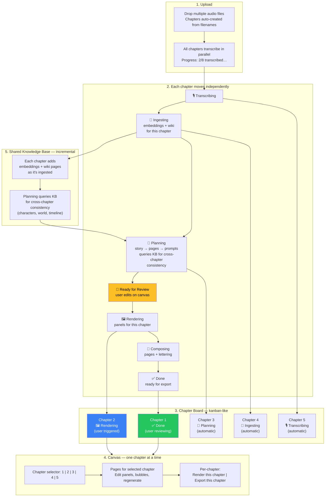

# Per-Chapter Pipeline Architecture

## Vision

The current global linear pipeline (9 steps, one project-level execution) is a developer debug tool. The user's mental model is: **drop files → wait → review → export**. Each chapter should move independently through stages — the user can review Chapter 1 while Chapter 3 is being planned and Chapter 5 is still transcribing.

The pipeline concept disappears from the user's view entirely. It becomes per-chapter status badges on a kanban-like board.

## Current Architecture (to be replaced)

```
Global PipelineActor (one per project):
  ingest_knowledge → build_bibles → plan_chapters (PAUSE) →
  render_panels → panel_qa → compose_pages → lettering →
  export_static → export_motion
```

Problems:
- Linear — can't work on Chapter 1 while Chapter 3 plans
- Global pause — all chapters blocked at the same checkpoint
- No incremental knowledge — re-running re-processes everything
- Pipeline tab is exposed to users as if it's a primary interface
- Adding a chapter after ingest requires manual invalidation

## Target Architecture

```
Per-chapter lifecycle (each chapter independent):
  transcribing → ingesting → planning → ready_for_review →
  rendering → composing → done

Shared Knowledge Base (incremental, project-level):
  Each chapter adds embeddings + wiki pages as it's ingested.
  Planning queries KB for cross-chapter consistency.
```

## User Flow



## UI Design

### Chapter Board (primary view)

```
┌─────────────────────────────────────────────────────────────┐
│  Project: Dungeon Crawler Carl                              │
│                                                              │
│  📁 Drop more chapters here          [+ Add chapter]         │
│                                                              │
│  ┌──────────┐ ┌──────────┐ ┌──────────┐ ┌──────────┐ ┌────┐│
│  │Chapter 1 │ │Chapter 2 │ │Chapter 3 │ │Chapter 4 │ │Ch 5││
│  │The Arrival│ │The Descent│ │The Gate │ │Labyrinth │ │Esc ││
│  │          │ │          │ │          │ │          │ │    ││
│  │  ✅ Done │ │ 🖼️ Render│ │ 📖 Plan  │ │ 🧠 Ingest│ │🎙️  ││
│  │ 8 pages  │ │ 6 pages  │ │ planning │ │ 45%      │ │ 12%││
│  │          │ │          │ │          │ │          │ │    ││
│  │[Review]  │ │[View]    │ │[Wait]    │ │[Wait]    │ │[···]│
│  └──────────┘ └──────────┘ └──────────┘ └──────────┘ └────┘│
│                                                              │
│  Knowledge Base: 4 chapters ingested, 127 entities, 23 chars│
└─────────────────────────────────────────────────────────────┘
```

### Canvas (per-chapter)

- Chapter selector at top: `Chapter 1 | Chapter 2 | Chapter 3 | ...`
- Pages grouped by the selected chapter only
- Per-chapter actions: "Render this chapter", "Export this chapter"
- Cross-chapter KB panel (read-only): characters, world, timeline

### Tabs (revised)

| Tab | Who | Purpose |
|---|---|---|
| **Chapters** | User | Board view, upload, status |
| **Canvas** | User | Review, edit, render, export — main workspace |
| **Knowledge** | User | Browse characters, wiki, timeline (read-only) |
| **Settings** | User | Provider config, models |
| ~~Pipeline~~ | ~~Developer~~ | **Removed from UI.** Debug via CLI/logs only. |

### Multi-file Upload

```
┌────────────────────────────────────────┐
│                                        │
│     📁 Drop audio files here           │
│        or click to browse              │
│                                        │
│  Supports .m4b .mp3 .m4a .wav .flac   │
│  Multiple files = multiple chapters    │
│                                        │
└────────────────────────────────────────┘
```

Filenames → chapter titles:
- `chapter_01_the_arrival.m4b` → "The Arrival"
- `Chapter 1 - The Arrival.m4b` → "The Arrival"
- `01 The Arrival.m4b` → "The Arrival"
- `the_arrival.m4b` → "The Arrival"

Rules: strip leading numbers, `chapter_N`/`Chapter N -` prefixes, file extensions, replace `_`/`-` with spaces, title case.

## Technical Design

### Per-Chapter State Machine

```
transcribing → ingesting → planning → ready_for_review →
rendering → composing → done

Error states: failed (at any stage)
User actions: retry (from failed), render (from ready_for_review), export (from done)
```

Each chapter stores its own `stage` and `stageStatus` in the `chapters` table. No global pipeline actor needed.

### Shared Knowledge Base

- Built incrementally — each chapter adds its embeddings + wiki pages during `ingesting`
- Track which chapters have been ingested (avoid re-processing)
- Planning queries KB via Mastra tools for cross-chapter consistency
- Adding a new chapter only ingests that chapter — no re-processing of existing ones

### What Happens to PipelineActor?

- **Removed from the user-facing flow.**
- The per-chapter stages replace the global pipeline steps.
- PipelineActor can remain as an internal orchestration tool or be removed entirely.
- The 9 global steps map to per-chapter stages:

| Global step | Per-chapter stage |
|---|---|
| (ChapterActor transcribes) | `transcribing` |
| `ingest_knowledge` (per-chapter) | `ingesting` |
| `plan_chapters` (per-chapter) | `planning` |
| (auto-pause checkpoint) | `ready_for_review` |
| `render_panels` (per-chapter) | `rendering` |
| `panel_qa` + `compose_pages` + `lettering` | `composing` |
| `export_static` + `export_motion` | `done` (export triggered on demand) |

### DB Changes

- `chapters` table: add `stage` (enum: transcribing, ingesting, planning, ready_for_review, rendering, composing, done, failed) and `stageProgress` (jsonb)
- New table: `chapter_ingest_log` (tracks which chapters have been ingested: chapterId, ingestedAt, embeddingsCount, wikiPagesCount)
- `build_bibles` becomes part of `ingesting` (per-chapter, not a separate global step)

### API Changes

- `POST /api/projects/[id]/chapters/upload-batch` — multi-file upload, creates chapters from filenames, starts transcription for each
- `POST /api/chapters/[id]/advance` — advance a chapter to its next stage (called automatically or by user action)
- `GET /api/projects/[id]/board` — returns all chapters with their current stage + progress for the board view
- `POST /api/chapters/[id]/render` — render panels for a single chapter
- `POST /api/chapters/[id]/export` — export a single chapter

### Actor Changes

- `ChapterActor` gains new actions: `Ingest`, `Plan`, `Render`, `Compose`, `Export`
- Each action advances the chapter to the next stage
- `KnowledgeBaseActor` gains `IngestChapter` (already exists) — called per-chapter during `ingesting`
- `PipelineActor` — deprecated, kept for CLI debug only

## Implementation Tickets

See GitHub issues labeled `per-chapter-architecture`:
1. Multi-file upload + filename → chapter title parser
2. Per-chapter state machine (DB schema + ChapterActor actions)
3. Chapter board UI (kanban-like card grid)
4. Auto-advance: transcription → ingest → plan (no user gate)
5. Per-chapter canvas (chapter selector, filtered pages)
6. Per-chapter render + export actions
7. Incremental knowledge base (track ingested chapters)
8. Remove pipeline tab from UI, demote to CLI debug
9. Knowledge base panel in canvas (read-only cross-chapter view)
