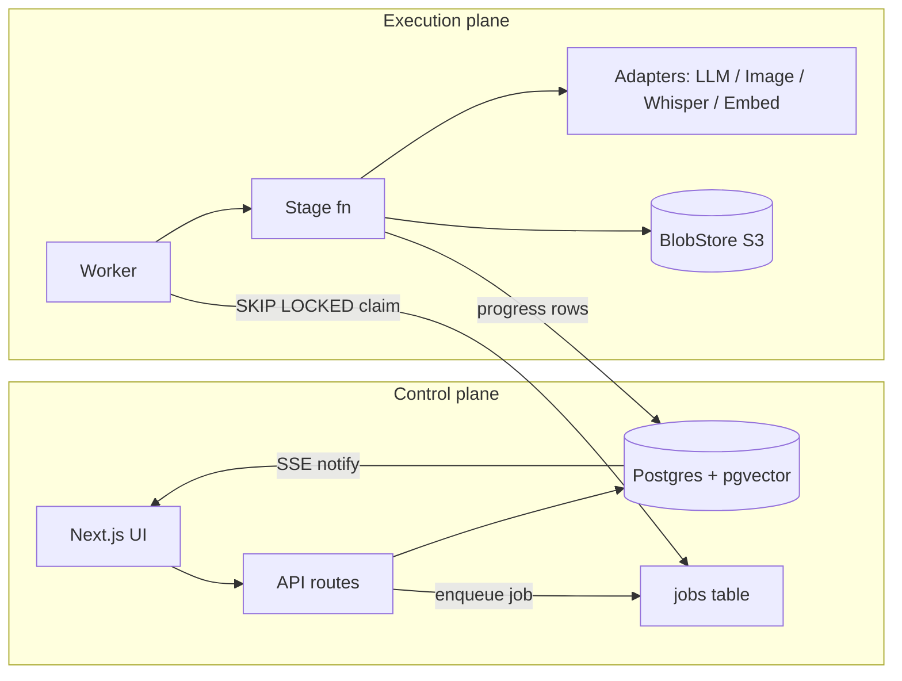

# 01 — Architecture

## Stack decision

| Concern | Choice | Why (traceable to v1 lesson) |
|---|---|---|
| Language | TypeScript, strict, one `tsconfig` base | v1's 314 typecheck errors came from tsconfig sprawl across 12 packages |
| Runtime | Bun | Fine in v1; fast installs, built-in test runner, `Bun.$` for ffmpeg |
| Repo shape | **Single app + 3 packages**, not 12 | v1 had 12 packages for ~22k LOC; boundaries cost more than they bought |
| Web | Next.js App Router + shadcn/ui + Tailwind | v1's UI stack was the one part that worked; keep it |
| Server state | TanStack Query everywhere | v1's ad-hoc `useEffect`+`fetch` produced silent errors and hanging spinners |
| DB | Postgres + pgvector + Drizzle | Proven in v1; pgvector HNSW worked well |
| Orchestration | **Plain Postgres job queue** (`FOR UPDATE SKIP LOCKED`) + one worker process | v1 lesson #1: Rivet actors + Effect v4 beta was the single largest source of friction (serial action queues, GetStatus timeouts, beta API churn, TS2742). A DB queue with a `stage` state machine per chapter does the same job with zero framework risk |
| Effects/errors | Plain async/await + typed `Result` returns at stage boundaries | No Effect. v1's `orDie`/`catchCause` hazards, fiber forking, and vendored-repo-as-docs all disappear |
| Storage | S3-compatible (R2/S3/MinIO) via one `BlobStore` interface | Same as v1 but named once and never renamed (v1 renamed `STORAGE_*` vars mid-stream) |
| Realtime | SSE per chapter (`/api/chapters/:id/events`) | v1's SSE worked; keep. No WebSockets needed |
| AI SDK | Vercel AI SDK v5 only — `generateObject` for all structured calls | v1 ran BOTH Mastra agents and raw AI SDK; two planner impls, streaming bugs (`partialObjectStream` buffering), Zod-default-undefined bugs. One SDK, no agent framework — "tools" become explicit context-assembly functions we call ourselves |
| Deploy | `docker compose up` (app, worker, postgres, minio) or hosted (Vercel + Neon + R2 + Fly worker) | v1's `dev.sh` (port-kills, 3 terminals, env foot-guns) is banned |

## Repo layout

```
storyweave/
  app/                    # Next.js — UI + API routes (control plane)
    src/app/              #   routes, api/
    src/components/       #   reader, storyboard, cast, canvas
  packages/
    core/                 # domain types (zod), stage contracts, pure logic
                          #   layout validation, timing math, prompt builders
    engine/               # stage implementations + adapters
                          #   stages/: ingest, script, cast, storyboard, render, letter, publish
                          #   adapters/: llm, image, transcribe, embed, blobstore
    db/                   # drizzle schema, migrations, repo functions, job queue
  worker/                 # thin entrypoint: poll queue → run stage → heartbeat
  compose.yaml
```

Rules:
- `core` imports nothing but zod. `engine` imports `core` + `db`. `app` imports all three.
- Every stage is a pure-ish function `(chapterId, deps) → Promise<StageResult>` — no
  framework types leak into stages.
- One root tsconfig; packages extend it with `include: ["src"]` only. `bun run typecheck`
  is CI-gating from commit 1 (v1 went weeks broken).

## System diagram



**Control/execution separation is absolute** (v1 lesson: actor action queues mixed the
two, so reading status blocked behind a 2-minute LLM call). The API never runs AI work
inline except sub-second reads. The worker never serves HTTP. They share only Postgres
and S3.

## The job queue (the whole orchestration story)

```sql
jobs(id, chapter_id, stage, status, attempt, max_attempts,
     run_after, heartbeat_at, error, created_at)
-- status: queued | running | done | failed | cancelled
```

- Worker claims: `UPDATE ... WHERE id = (SELECT id FROM jobs WHERE status='queued'
  AND run_after <= now() ORDER BY created_at FOR UPDATE SKIP LOCKED LIMIT 1)`.
- Heartbeat every 15s; a reaper re-queues rows with stale heartbeats (crash recovery —
  this is the "durable execution" v1 got from actors, in 40 lines).
- Retries with exponential backoff via `run_after`; poison jobs → `failed` + surfaced in UI.
- Concurrency: N worker loops in one process; per-provider rate limiting inside adapters.
- **Idempotency is per-stage, not per-queue**: every stage checks "which outputs already
  exist?" and skips them (v1's `renderResultId` skip pattern — the one orchestration idea
  worth keeping). Re-running any stage is always safe.

Chapter progression is a state machine column (`chapters.stage`), advanced by the worker
when a stage completes; auto-advance stops at the two review gates (v1's ChapterActor
auto-advance concept, minus the actor).

## Adapter layer

One interface per capability; provider chosen per-project with env fallback:

```ts
LLM        .generateObject({ schema, system, prompt, model })   // openrouter | openai | anthropic | google
ImageGen   .render({ prompt, negative, refs: Ref[], aspect, seed })  // gemini-image | gpt-image | pollinations | fal
Transcriber.transcribe({ audio, language })                     // whisper-api | groq | local-whisperx
Embedder   .embed(texts)                                        // openai | voyage
BlobStore  .put/get/presign
```

Non-negotiable adapter requirements (each was a v1 bug):
- `ImageGen.render` **accepts reference images** in the core interface — not a schema
  field that gets dropped (v1's `referenceImageKeys: []` hardcode).
- All structured LLM calls: JSON-mode first, one repair pass on parse failure, degenerate-
  output detection (empty arrays where content is required → retry with stronger prompt).
  This is v1's hard-won "defense-in-depth" checklist, centralized in ONE wrapper.
- Prompt length guards per image provider (v1: Pollinations 400s on long prompts).
- Aspect-ratio strategy per provider (v1: generate square, crop — keep as a provider-level
  policy, not caller knowledge).

## Model policy (launch defaults, all swappable)

| Task | Default | Notes |
|---|---|---|
| Transcription | `whisper-large-v3` via Groq | Segment-level timestamps sufficient (v1 validated); word-level optional upgrade for finer sync |
| Script/storyboard planning | Strong reasoning model via OpenRouter (e.g. `gemini-2.5-pro` / `claude-sonnet`) | Structured output, chunked per scene |
| Cheap extraction/QA text | `gemini-2.5-flash`-class | Entity extraction, summaries |
| Panel render | **Multi-reference-capable model required**: `gemini-2.5-flash-image` (nano-banana) or `gpt-image-1`; fal.ai FLUX-kontext as alt | The consistency strategy depends on native multi-image conditioning — this is why v1's text-only rendering failed |
| Panel QA judge | VLM (`gemini-flash`-class) | Identity + prompt-adherence checks |
| Embeddings | `text-embedding-3-small` | pgvector, 1536d |

## Cross-cutting

- **Config**: single `Settings` table (project overrides → env defaults). Two required
  secrets to boot: one LLM key, one image key. Everything else optional.
- **Cost metering**: every adapter call writes `usage_events(provider, model, tokens|images, est_cost, chapter_id, stage)`. Surfaced per chapter in UI. v1 had zero cost visibility.
- **Observability**: structured JSON logs with `{chapterId, stage, jobId}` on every line;
  stage progress rows (`progress(chapter_id, stage, current, total, note)`) drive both
  SSE and post-mortem debugging.
- **Testing**: `core` is pure → unit tests from day 1 (layout math, timing, prompt
  builders, chunking). `engine` stages get golden-file tests with a `FakeAdapters` suite
  (deterministic placeholder image gen, canned LLM fixtures). v1 shipped zero tests; the
  eval metrics it wrote (layout IoU, timing drift, consistency) get wired into CI here.
