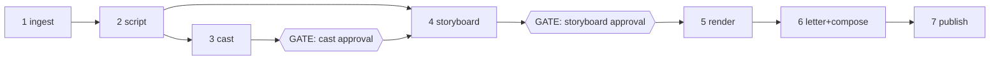

# 02 — Production Pipeline

Seven stages, not fifteen. v1's 15 steps collapsed in practice into a few mega-steps plus
orphaned dead files; we design for the real granularity. Each stage is idempotent,
resumable, and writes versioned artifacts. `[GATE]` = human approval required to proceed.

Book-level: cast is shared across chapters (built incrementally, chapter order).
Chapter-level: script, storyboard, render, letter, publish run per chapter, in parallel
across chapters.

---

## Stage 1 — Ingest

**In**: m4b/mp3/epub/txt upload. **Out**: `chapters[]`, `transcript_segments[]` with timings.

- m4b/mp4: `ffprobe -show_chapters` → split by embedded markers (stream copy). Fallback:
  one chapter per file; user can split manually later.
- Audio → transcription adapter → segments `{text, startSec, endSec}`. Normalize to
  ~sentence-level segments (merge fragments, split run-ons at punctuation).
- epub/txt: chapter detection from headings/spine; segments get **no timings** — the
  project is flagged `silent` (reader works without audio sync; no motion export).
- Everything stored; audio chunks uploaded to BlobStore with stable keys
  (`{project}/{chapter}/audio.mp3`, `.../segments.json`).

Deterministic except the transcription call. Cost: transcription only.

## Stage 2 — Script

**In**: transcript segments. **Out**: `scenes[]` and `beats[]` — the editorial breakdown.

The LLM converts prose narration into comic-script structure:

- **Scene** = contiguous span of segments with a location + cast + mood
  (`{title, summary, location, characters[], tone, segmentRange}`).
- **Beat** = a moment within a scene that becomes 1–3 panels
  (`{summary, dialogue[], action, emotionalBeat, segmentRange}`).
- **Dialogue extraction is the critical output**: each beat carries
  `dialogue: [{speaker, line, kind: speech|thought|narration|sfx}]` with `line` being a
  *shortened, letterable* version of the source text (bubbles hold ~25 words max). The
  original segment mapping is preserved for audio sync.
- Chunked processing: one LLM call per ~3k words with a rolling "story so far" summary +
  bible retrieval (see Stage 3). No monolithic whole-chapter calls (v1's Pass-1 degenerate
  output bug came from oversized calls).
- Simultaneously appends to the **story bible**: new characters/locations/objects
  encountered, with first-appearance descriptions, merged by normalized name + embedding
  similarity (v1's 3-layer character dedup — keep the idea, simplify to name+embedding).

Every scene/beat row keeps `segmentRange` — this single invariant powers audio sync
through the whole system.

## Stage 3 — Cast (the consistency engine) `[GATE]`

**In**: story bible entries. **Out**: approved **reference sheets**.

This is the stage v1 never really had, and it's the core of the rebuild.

1. For each principal character: LLM writes a canonical *visual spec* (age, build, face,
   hair, wardrobe, palette, distinguishing marks) from bible evidence — quoted from the
   text where possible.
2. Image adapter generates a **model sheet**: front portrait + full-body, neutral pose,
   flat background, in the project's chosen art style. 2–4 candidates per character.
3. Same for recurring locations (establishing wide shot) and key objects.
4. **User gate**: pick a candidate / regenerate with notes / upload their own image /
   edit the visual spec text. Approval freezes `cast_refs` version 1.
5. Later chapters that introduce new characters re-open a mini-cast-gate for the new
   entries only; approved refs are immutable (new look = new version, old panels keep
   pointing at the version they used).

Style is a project-level **style pack**: one prompt fragment + optional style reference
image, chosen at project creation from presets (manga, western, noir, watercolor…) or
custom. Every render includes it; the cast sheets are generated *in* it, so approving
cast = approving style.

Cost before this gate: a few dozen images. Nothing else renders until approval.

## Stage 4 — Storyboard `[GATE]`

**In**: beats + cast. **Out**: `pages[]` and `panels[]` — layout + per-panel specs.

- Pacing pass: beats → pages. Target panels/page by density heuristic (dialogue-heavy →
  more small panels; action/reveal → splash). LLM proposes; deterministic validator
  enforces: panel count 1–9, bboxes within page, no overlap, full coverage, valid reading
  order.
- Layout templates, not freeform bboxes: the LLM picks from a curated library of ~25 grid
  templates (2x2, 1+2, splash, tall-left…) and assigns beats to slots. v1 let the LLM emit
  raw rectangles and then had to validate/repair; templates make invalid layouts
  unrepresentable.
- Per-panel spec: `{beatId, slot, description, camera (shot size + angle), charactersPresent[],
  location, dialogueRefs[], sfx[], mood}`.
- **Prompt compilation is deterministic** (`core/prompt/panel.ts`): the LLM authors only
  structured fields (description, camera, mood); the compiler assembles the actual image
  prompt — full template and rationale in [08-prompts.md](08-prompts.md). Continuity/
  narrative context stays OUT of image prompts (it induces multi-panel collages); the
  anti-text line is mandatory. Composed prompt stored on the panel row, editable.
- **User gate — storyboard review**: page-by-page view showing layout wireframe + per-panel
  description + dialogue. Edit any text field, merge/split panels, reorder, change camera.
  Approving unlocks rendering. (v1 added a storyboard tab at the very end; here it's the
  main event.)

Cost: LLM text only.

## Stage 5 — Render

**In**: approved panels + cast refs. **Out**: `renders[]` (versioned images per panel).

- For each panel: collect refs — cast sheets for `charactersPresent` (≤3; crowd panels
  degrade to descriptors), location ref, style ref. Call `ImageGen.render` with prompt +
  refs + aspect from the layout slot.
- **Multi-reference conditioning is mandatory**, provider-native (gemini flash image /
  gpt-image edits / FLUX-kontext). No text-only rendering path for character panels.
- Concurrency-limited fan-out with per-provider rate limits; progress row per panel drives
  the UI ("Drawing 23/41").
- **Panel QA (automated, non-blocking)**: (a) sharp pixel stats — blank/flat/corrupt
  detection; (b) VLM judge — "does this match the prompt? is it a single panel? is
  <character> consistent with this reference sheet?" → `qa: passed|warn|failed + notes`.
  One automatic retry with adjusted seed/prompt on `failed`; then surface as a badge for
  human eyes. Never auto-block the chapter on QA (v1's placeholder-QA and later
  strict-QA both erred; warn-and-continue is right).
- Renders are **append-only versions**; panel points at `activeRenderId`. Regenerate =
  new version; old ones remain selectable in UI.

Cost: the big one — gated behind two approvals, per-chapter, resumable at panel
granularity.

## Stage 6 — Letter + Compose

**In**: active renders + dialogue + layout. **Out**: composed page images + overlay data.

- **All text is typeset. Zero in-image text.** v1 pivoted to baking bubbles into the
  image; that pivot is reversed and settled: burned-in text can't be edited, localized,
  or re-flowed, and models still misspell. Bubbles are SVG overlays rendered onto the
  panel at compose time (exports) and as DOM/SVG in the reader (live).
- Auto-placement: bubble anchored near speaker via VLM-located head bbox (single cheap
  call per panel returning face boxes → placement avoids faces; v1 never implemented its
  Bubble Placement Score — this is the pragmatic version). Reading-order-consistent
  (top-left → bottom-right per bubble sequence).
- 4 bubble types (speech/thought/narration/sfx) with tails; fonts from the style pack.
- Compose: sharp — page canvas, place panels per layout bbox, gutters, then bubble layer.
  Pure function of `(renders, layout, bubbles)`.
- Bubble positions user-editable in the canvas editor; edits persist as overlay data and
  recompose the page cheaply.

Deterministic except the face-locate call. Cost: cents.

## Stage 7 — Publish

**In**: composed pages + timing map. **Out**: reader manifest, CBZ, PDF, MP4.

- **Timing map** (the sync spine): each panel derives `[startSec, endSec]` from its
  beat's `segmentRange`. Pure math, recomputed on any edit.
- **Reader manifest**: JSON per chapter — pages, panel bboxes, bubble overlays, timing
  map, audio URL. The web reader consumes only this.
- CBZ: zip of page PNGs. PDF: pdf-lib embedding at native resolution.
- MP4: ffmpeg per-panel segments (Ken Burns from a small motion-type table: static, zoom,
  pan by camera type), concat stream-copy, mux original audio. Bubbles rendered into
  frames at this point only.
- All exports are cache-invalidated projections: editing a bubble re-publishes in seconds.

---

## The consistency strategy, summarized

| Layer | Mechanism |
|---|---|
| 1. Canonical visual specs | Text specs frozen at cast approval; injected into every prompt |
| 2. Reference images | Approved model sheets passed natively to the image model per panel |
| 3. Style pack | Same style fragment + style ref on every render including cast sheets |
| 4. VLM identity QA | Post-render check against the ref sheet, warn-level |
| 5. Bible + retrieval | pgvector over bible entries + scene summaries; script/storyboard stages retrieve top-k for context (planner-side memory — v1 proved image-side memory injection is harmful) |

## Error-handling doctrine (uniform across stages)

- Stage functions return `{ok} | {retryable, error} | {fatal, error}`; the queue retries
  retryables with backoff, parks fatals with the error surfaced on the chapter card.
- Partial progress always persists (per-scene, per-panel). Re-run continues, never redoes.
- LLM structured calls: schema-validate → repair-parse once → degenerate-check → retry
  once with escalated model → fatal. Centralized in the LLM adapter, tested with fixtures.
