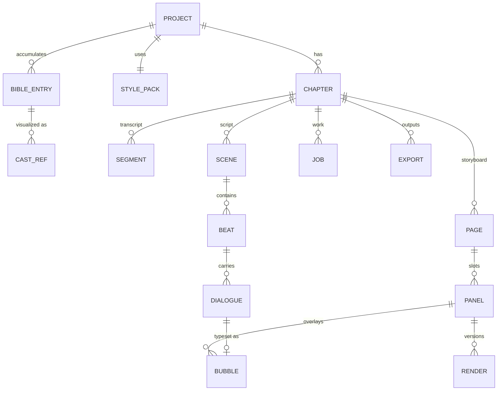

# 03 — Data Model

Principles (each fixes a v1 defect):
- **Explicit `position` columns with unique constraints** on every ordered entity
  (v1 retrofitted ordering and had random panel order in the canvas).
- **AI outputs are append-only versions** with an `active_*` pointer (v1 overwrote
  renders/prompts in place, losing history).
- **`segment_range` on scenes/beats is the sync invariant** — never derived, never dropped.
- **Migrations are the only schema source**; Drizzle schema generated/checked against them
  in CI (v1 had silent Drizzle↔migration drift eating columns).
- No entity exists without a consumer (v1 carried Issue, panel_edits, TTS fields, and
  `ipAdapterRefs` that nothing read).

## Entity graph



## Tables

### Project plane
```
projects(id, title, source_kind: audio|text, settings jsonb, created_at)
style_packs(id, project_id, name, prompt_fragment, negative_fragment,
            style_ref_key?, fonts jsonb)
settings: provider/model overrides, render concurrency, panel QA on/off
```

### Bible plane (cross-chapter, append-only)
```
bible_entries(id, project_id, kind: character|location|object|lore,
              name, aliases text[], summary, visual_spec text,
              first_chapter_id, evidence jsonb,     -- quoted source snippets
              embedding vector(1536), status: proposed|active|retired,
              unique(project_id, kind, name))
cast_refs(id, bible_entry_id, version, image_key, kind: portrait|full_body|establishing,
          prompt, status: candidate|approved|rejected,
          unique(bible_entry_id, kind, version))
-- bible_entries.active_ref_version → approved set frozen at cast gate
```

### Chapter plane
```
chapters(id, project_id, position, title,
         audio_key?, duration_sec?,
         stage: ingested|scripted|casting|storyboarding|
                awaiting_storyboard_approval|rendering|lettering|published,
         stage_error?, unique(project_id, position))
segments(id, chapter_id, position, text, start_sec?, end_sec?,
         unique(chapter_id, position))
scenes(id, chapter_id, position, title, summary, location_entry_id?,
       tone, segment_start, segment_end, unique(chapter_id, position))
beats(id, scene_id, position, summary, action, emotional_beat,
      segment_start, segment_end, unique(scene_id, position))
dialogues(id, beat_id, position, speaker_entry_id?, kind: speech|thought|narration|sfx,
          line,                    -- letterable short text
          source_segment_id,       -- audio-sync anchor
          unique(beat_id, position))
```

### Storyboard plane
```
pages(id, chapter_id, position, template_id, unique(chapter_id, position))
panels(id, page_id, slot, beat_id, description, camera jsonb,
       characters uuid[],          -- bible_entry ids
       location_entry_id?, mood,
       prompt, negative_prompt,    -- compiled, user-editable
       aspect, seed?,
       active_render_id?,
       qa_status: pending|passed|warn|failed, qa_notes?,
       unique(page_id, slot))
layout_templates(id, name, slots jsonb)   -- seeded library, bbox per slot
```

### Output plane
```
renders(id, panel_id, version, image_key, provider, model, prompt_used,
        refs_used jsonb, seed, created_at, unique(panel_id, version))
bubbles(id, panel_id, dialogue_id?, kind, text, bbox jsonb, tail jsonb,
        auto_placed bool, position int)
composed_pages(id, page_id, image_key, content_hash, created_at)
exports(id, chapter_id, kind: manifest|cbz|pdf|mp4, key, content_hash, created_at)
```

### Infrastructure plane
```
jobs(id, chapter_id?, project_id, stage, status: queued|running|done|failed|cancelled,
     attempt, max_attempts, run_after, heartbeat_at, error, payload jsonb)
progress(id, job_id, current, total, note, updated_at)
usage_events(id, project_id, chapter_id?, stage, provider, model,
             input_tokens?, output_tokens?, images?, est_cost_usd, created_at)
```

## Blob storage layout

```
{project}/source/{original filename}
{project}/chapters/{ch}/audio.m4a
{project}/cast/{entry}/{kind}-v{n}.png
{project}/chapters/{ch}/renders/{panel}-v{n}.png
{project}/chapters/{ch}/pages/{page}-{hash}.png
{project}/chapters/{ch}/exports/{kind}-{hash}.*
```

Stable, human-debuggable keys. Content-hash suffixes on derived artifacts double as
cache-busting URLs (v1 needed retrofitted cache-busting for the canvas).

## Versioning & invalidation semantics

- **Edit a prompt/description** → panel's renders stale-flagged (badge), nothing deleted;
  next render creates v(n+1).
- **Edit a bubble** → recompose page + re-publish manifest; renders untouched.
- **Approve new cast version** → affected panels (those whose `characters` include the
  entry) get stale badges; user chooses what to re-render. Never cascade-delete.
- **Storyboard edits after approval** → chapter drops back to `storyboarding` state for
  the affected pages only; unaffected pages keep renders.
- Derived artifacts (composed pages, exports) recompute when `content_hash` of inputs
  changes — cheap, deterministic, no bookkeeping DAG (this replaces v1's planned
  stale-detection engine with hashing).

## Retrieval (pgvector)

Two embedded surfaces only (v1 embedded 7 tables; 2 carried all the value):
- `bible_entries.embedding` — entity retrieval during script/storyboard stages.
- `scene_summaries` embedding (on scenes) — "story so far" retrieval for long books.

HNSW indexes on both. Retrieval is a plain function (`topK(projectId, query, kind?)`)
called by stages when assembling LLM context — not agent "tools" (v1's Mastra tool layer
added indirection without measurable quality gain over direct context assembly).
